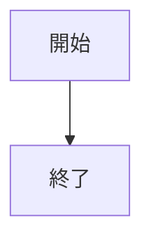
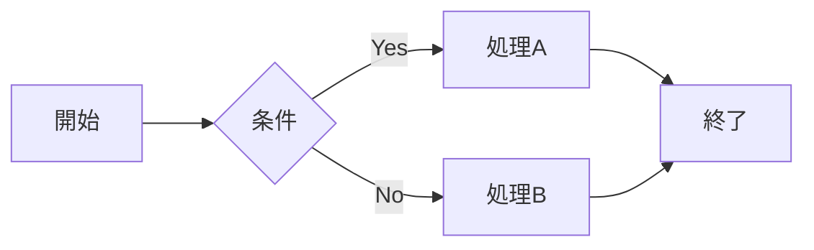
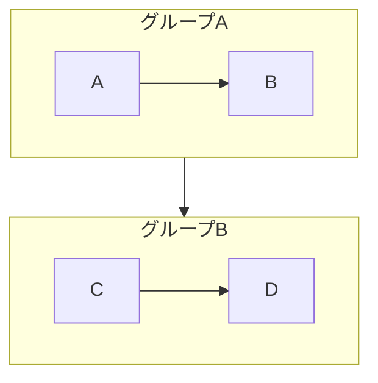
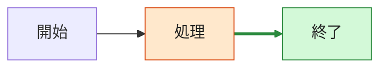
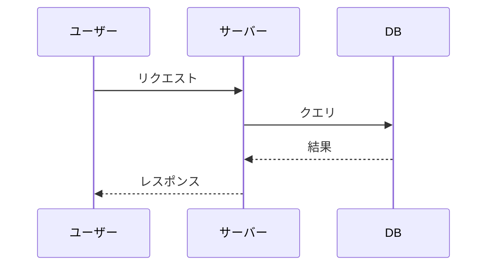
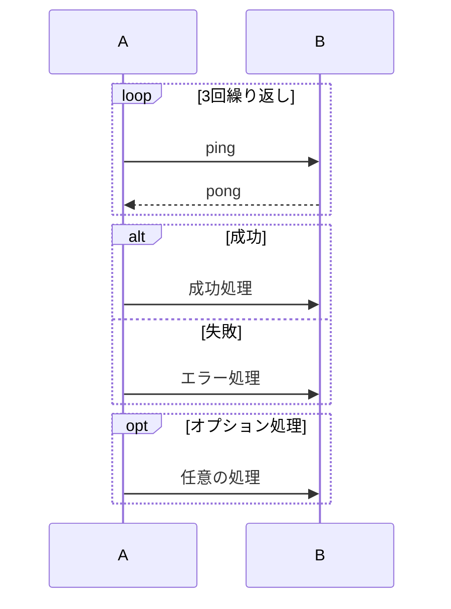
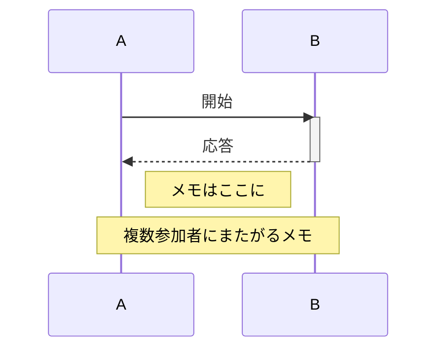
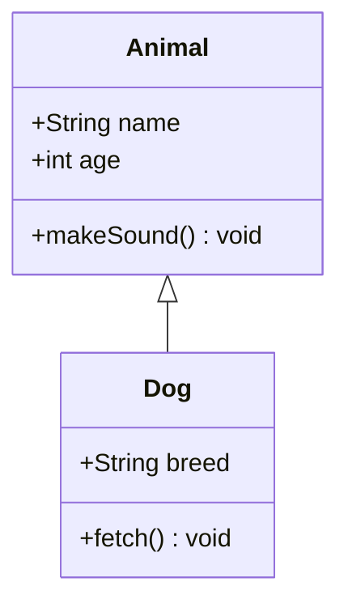

---
tags:
  - Mermaid
  - Tools
  - Diagram
created: 2026-05-29
updated: 2026-05-29
---

# Mermaid リファレンス

## 目次

- [基本構文](#基本構文)
- [環境差・注意点](#環境差注意点)
- [フローチャート](#フローチャート)
- [シーケンス図](#シーケンス図)
- [クラス図](#クラス図)
- [ER図](#er図)
- [状態遷移図](#状態遷移図)
- [ガントチャート](#ガントチャート)
- [パイチャート](#パイチャート)
- [マインドマップ](#マインドマップ)
- [タイムライン](#タイムライン)
- [Gitグラフ](#gitグラフ)
- [テーマ・設定](#テーマ設定)
- [その他の図種](#その他の図種)
- [リンク集](#リンク集)

> Mermaid は Markdown コードブロックに `mermaid` を指定して記述する。GitHub・GitLab・Obsidian・Notion 等の対応環境でレンダリングされるが、利用できる図種・構文・設定は環境や Mermaid のバージョンにより異なる。

---

## 基本構文

記述例:

````markdown

````

表示例:


### コメント

Markdown 上でコメント記法そのものを見せたい場合は、外側を `markdown` コードブロックにする。

記述例:

````markdown

````

表示例:


---

## 環境差・注意点

- Mermaid の対応バージョンはサービスやエディタにより異なる
- 新しい図種や `beta` 付きの図種は、環境によって表示できないことがある
- GitHub などのホスティングサービスでは、セキュリティ上の理由で一部の設定や HTML が制限されることがある
- 複雑な図や新しい構文は Mermaid Live Editor や利用先のプレビューで確認する

### 壊れやすい記法

| 対象 | 注意点 | 対策 |
|------|--------|------|
| コメント | `%%{ }%%` に似た文字列は directive と衝突することがある | コメント内で `{}` を多用しない |
| フローチャート | `end` は構文上の終端として解釈されることがある | ラベルを `"end"` のように引用符で囲む |
| ノード内テキスト | 記号や入れ子風の括弧で壊れることがある | 表示名を引用符で囲む |
| 日本語・記号 | 処理系により解釈差が出ることがある | ID は英数字、表示名は `A["表示名"]` のように分ける |

---

## フローチャート

`flowchart` で定義する。`graph` も旧来の記法として使える。方向は `TD` / `TB`（上→下）、`LR`（左→右）、`BT`（下→上）、`RL`（右→左）。

記述例:

````markdown

````

表示例:


### ノードの形状

| 記法 | 形状 |
|------|------|
| `A[テキスト]` | 四角形 |
| `A(テキスト)` | 角丸四角形 |
| `A((テキスト))` | 円 |
| `A{テキスト}` | ひし形（条件） |
| `A>テキスト]` | 非対称 |
| `A[/テキスト/]` | 平行四辺形 |
| `A[(テキスト)]` | データベース |
| `A[[テキスト]]` | サブルーチン |

`A[開始]` の `A` はノードID、`開始` は表示ラベル。日本語や記号を含むラベルを使う場合でも、ID は `start` のような英数字にしておくと、参照やスタイル指定が安定しやすい。

記述例:

````markdown

````

表示例:


### エッジの種類

| 記法 | 種類 |
|------|------|
| `A --> B` | 矢印 |
| `A --- B` | 線のみ |
| `A -- テキスト --> B` | ラベル付き矢印 |
| `A -->\|テキスト\| B` | ラベル付き矢印（別記法） |
| `A -.-> B` | 点線矢印 |
| `A ==> B` | 太線矢印 |
| `A --o B` | 円端 |
| `A --x B` | × 端 |
| `A <--> B` | 双方向 |

### サブグラフ

記述例:

````markdown

````

表示例:


### スタイル

記述例:

````markdown

````

表示例:


---

## シーケンス図

記述例:

````markdown

````

表示例:


### 矢印の種類

| 記法 | 種類 |
|------|------|
| `->>` | 実線矢印 |
| `-->>` | 点線矢印 |
| `->` | 実線（矢印なし） |
| `-->` | 点線（矢印なし） |
| `-x` | 実線（×端） |
| `--x` | 点線（×端） |

### ループ・条件

記述例:

````markdown

````

表示例:


### 活性化・メモ

記述例:

````markdown

````

表示例:


---

## クラス図

記述例:

````markdown

````

表示例:


### 関係の種類

| 記法 | 意味 |
|------|------|
| `A <\|-- B` | 継承（BはAを継承） |
| `A *-- B` | コンポジション |
| `A o-- B` | 集約 |
| `A --> B` | 関連 |
| `A -- B` | リンク |
| `A ..> B` | 依存 |
| `A ..\|> B` | 実現（インターフェース実装） |

### アクセス修飾子

| 記号 | 意味 |
|------|------|
| `+` | public |
| `-` | private |
| `#` | protected |
| `~` | package |

---

## ER図

記述例:

````markdown
```mermaid
erDiagram
  USER {
    int id PK
    string name
    string email
  }

  ORDER {
    int id PK
    int user_id FK
    date created_at
  }

  ITEM {
    int id PK
    string name
    int price
  }

  ORDER_ITEM {
    int order_id FK
    int item_id FK
    int quantity
  }

  USER ||--o{ ORDER : "places"
  ORDER ||--|{ ORDER_ITEM : "contains"
  ITEM ||--o{ ORDER_ITEM : "in"
```
````

表示例:

```mermaid
erDiagram
  USER {
    int id PK
    string name
    string email
  }

  ORDER {
    int id PK
    int user_id FK
    date created_at
  }

  ITEM {
    int id PK
    string name
    int price
  }

  ORDER_ITEM {
    int order_id FK
    int item_id FK
    int quantity
  }

  USER ||--o{ ORDER : "places"
  ORDER ||--|{ ORDER_ITEM : "contains"
  ITEM ||--o{ ORDER_ITEM : "in"
```

### カーディナリティ

カーディナリティは関係線の左右に付ける。実際には `USER ||--o{ ORDER : places` のように、左右の記号・線種・ラベルを組み合わせて使う。

| 記法 | 意味 |
|------|------|
| `\|o` | 0または1 |
| `\|\|` | 厳密に1 |
| `o{` | 0以上 |
| `\|{` | 1以上 |

### 関係の例

| 記法 | 意味 |
|------|------|
| `A \|\|--\|\| B` | 1対1 |
| `A \|\|--o{ B` | 1対0以上 |
| `A \|\|--\|{ B` | 1対1以上 |
| `A }o--o{ B` | 0以上対0以上 |

---

## 状態遷移図

記述例:

````markdown
```mermaid
stateDiagram-v2
  [*] --> 待機中

  待機中 --> 処理中 : 開始
  処理中 --> 完了 : 成功
  処理中 --> エラー : 失敗
  エラー --> 待機中 : リトライ
  完了 --> [*]
```
````

表示例:

```mermaid
stateDiagram-v2
  [*] --> 待機中

  待機中 --> 処理中 : 開始
  処理中 --> 完了 : 成功
  処理中 --> エラー : 失敗
  エラー --> 待機中 : リトライ
  完了 --> [*]
```

### 複合状態

記述例:

````markdown
```mermaid
stateDiagram-v2
  state 複合状態 {
    [*] --> 子状態A
    子状態A --> 子状態B
  }

  [*] --> 複合状態
  複合状態 --> [*]
```
````

表示例:

```mermaid
stateDiagram-v2
  state 複合状態 {
    [*] --> 子状態A
    子状態A --> 子状態B
  }

  [*] --> 複合状態
  複合状態 --> [*]
```

### 並行状態

記述例:

````markdown
```mermaid
stateDiagram-v2
  state 並行 {
    [*] --> A
    --
    [*] --> B
  }
```
````

表示例:

```mermaid
stateDiagram-v2
  state 並行 {
    [*] --> A
    --
    [*] --> B
  }
```

---

## ガントチャート

記述例:

````markdown
```mermaid
gantt
  title プロジェクトスケジュール
  dateFormat YYYY-MM-DD
  excludes weekends

  section 設計
    要件定義    : done,    des1, 2026-01-01, 2026-01-07
    設計        : active,  des2, 2026-01-08, 7d

  section 開発
    実装        :          dev1, after des2, 14d
    テスト      :          dev2, after dev1, 7d

  section リリース
    デプロイ    : milestone, m1, after dev2, 1d
```
````

表示例:

```mermaid
gantt
  title プロジェクトスケジュール
  dateFormat YYYY-MM-DD
  excludes weekends

  section 設計
    要件定義    : done,    des1, 2026-01-01, 2026-01-07
    設計        : active,  des2, 2026-01-08, 7d

  section 開発
    実装        :          dev1, after des2, 14d
    テスト      :          dev2, after dev1, 7d

  section リリース
    デプロイ    : milestone, m1, after dev2, 1d
```

### タスクの状態

| キーワード | 意味 |
|------------|------|
| `done` | 完了 |
| `active` | 進行中 |
| `crit` | 重要 |
| `milestone` | マイルストーン |

---

## パイチャート

記述例:

````markdown
```mermaid
pie title ブラウザシェア
  "Chrome"  : 65
  "Safari"  : 19
  "Firefox" : 4
  "Edge"    : 4
  "その他"  : 8
```
````

表示例:

```mermaid
pie title ブラウザシェア
  "Chrome"  : 65
  "Safari"  : 19
  "Firefox" : 4
  "Edge"    : 4
  "その他"  : 8
```

---

## マインドマップ

記述例:

````markdown
```mermaid
mindmap
  root((Mermaid))
    フローチャート
      graph
      flowchart
    シーケンス図
    クラス図
    ER図
    その他
      ガント
      パイ
      マインドマップ
```
````

表示例:

```mermaid
mindmap
  root((Mermaid))
    フローチャート
      graph
      flowchart
    シーケンス図
    クラス図
    ER図
    その他
      ガント
      パイ
      マインドマップ
```

---

## タイムライン

記述例:

````markdown
```mermaid
timeline
  title 技術の歴史
  section 1990年代
    1991 : HTML 誕生
    1995 : JavaScript 誕生
    1999 : jQuery の前身技術
  section 2000年代
    2004 : Gmail 登場（Ajax 普及）
    2009 : Node.js 登場
  section 2010年代
    2013 : React 公開
    2016 : Vue.js 公開
```
````

表示例:

```mermaid
timeline
  title 技術の歴史
  section 1990年代
    1991 : HTML 誕生
    1995 : JavaScript 誕生
    1999 : jQuery の前身技術
  section 2000年代
    2004 : Gmail 登場（Ajax 普及）
    2009 : Node.js 登場
  section 2010年代
    2013 : React 公開
    2016 : Vue.js 公開
```

---

## Gitグラフ

記述例:

````markdown
```mermaid
gitGraph
  commit id: "initial"
  branch feature/login
  checkout feature/login
  commit id: "add login form"
  commit id: "add validation"
  checkout main
  merge feature/login id: "merge login"
  branch hotfix
  checkout hotfix
  commit id: "fix bug"
  checkout main
  merge hotfix
```
````

表示例:

```mermaid
gitGraph
  commit id: "initial"
  branch feature/login
  checkout feature/login
  commit id: "add login form"
  commit id: "add validation"
  checkout main
  merge feature/login id: "merge login"
  branch hotfix
  checkout hotfix
  commit id: "fix bug"
  checkout main
  merge hotfix
```

---

## テーマ・設定

Mermaid では図ごとにテーマや描画設定を指定できる。対応状況はレンダリング環境により異なる。

### Directive

記述例:

````markdown
```mermaid
%%{init: {"theme": "neutral"}}%%
flowchart LR
  A[開始] --> B[終了]
```
````

表示例:

```mermaid
%%{init: {"theme": "neutral"}}%%
flowchart LR
  A[開始] --> B[終了]
```

### Frontmatter

記述例:

````markdown
```mermaid
---
title: 設定例
config:
  theme: neutral
---
flowchart LR
  A[開始] --> B[終了]
```
````

表示例:

```mermaid
---
title: 設定例
config:
  theme: neutral
---
flowchart LR
  A[開始] --> B[終了]
```

### よく使う設定

| 設定 | 用途 |
|------|------|
| `theme` | `default`、`neutral`、`dark`、`forest` などのテーマ |
| `look` | `classic`、`handDrawn` などの見た目 |
| `layout` | `dagre`、`elk` などのレイアウトアルゴリズム |

---

## その他の図種

Mermaid には上記以外にも多くの図種がある。新しい図種は環境によって未対応の場合がある。

| 図種 | 開始キーワード | 用途 |
|------|----------------|------|
| User Journey | `journey` | ユーザー体験・満足度の流れ |
| Quadrant Chart | `quadrantChart` | 2軸の分類 |
| Requirement Diagram | `requirementDiagram` | 要件と要素の関係 |
| C4 Diagram | `C4Context` など | システム構成・コンテキスト |
| Sankey | `sankey-beta` | 流量・内訳の可視化 |
| XY Chart | `xychart-beta` | 棒グラフ・折れ線グラフ |
| Block Diagram | `block-beta` | ブロック構造 |
| Packet | `packet-beta` | パケット構造 |
| Kanban | `kanban` | カンバン |
| Architecture | `architecture-beta` | アーキテクチャ構成 |
| Radar | `radar-beta` | レーダーチャート |
| Treemap | `treemap-beta` | 階層データの面積表示 |
| Venn | `venn-beta` | 集合関係 |
| Ishikawa | `ishikawa` | 特性要因図 |

---

## リンク集

### 公式

| リンク | 内容 |
|--------|------|
| [Mermaid 公式ドキュメント](https://mermaid.js.org/) | Mermaid 全体の公式ドキュメント |
| [Diagram Syntax](https://mermaid.js.org/intro/syntax-reference.html) | 図種ごとの構文一覧 |
| [Mermaid Live Editor](https://mermaid.live/) | Mermaid をブラウザで試せる公式エディタ |
| [Mermaid GitHub リポジトリ](https://github.com/mermaid-js/mermaid) | ソースコード、Issue、リリース情報 |

### 利用環境

| リンク | 内容 |
|--------|------|
| [GitHub Docs: Creating diagrams](https://docs.github.com/en/get-started/writing-on-github/working-with-advanced-formatting/creating-diagrams) | GitHub Markdown で Mermaid を使う方法 |
| [GitLab Docs: GitLab Flavored Markdown](https://docs.gitlab.com/user/markdown/#diagrams-and-flowcharts) | GitLab Markdown で Mermaid を使う方法 |
